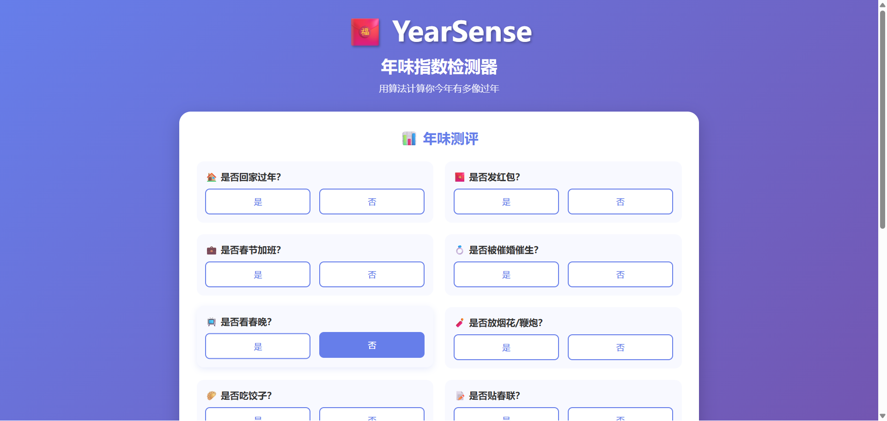
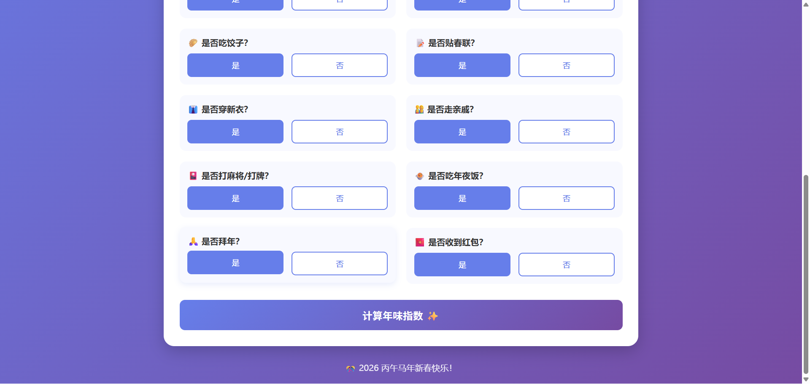
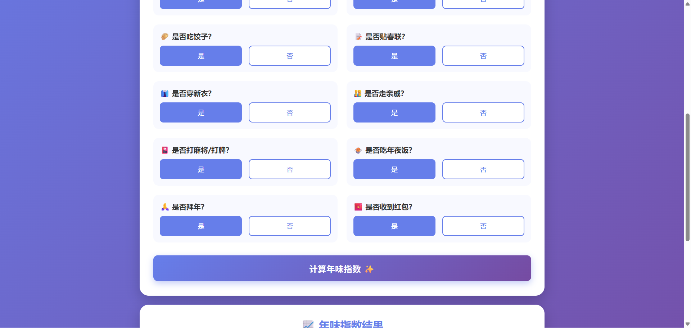
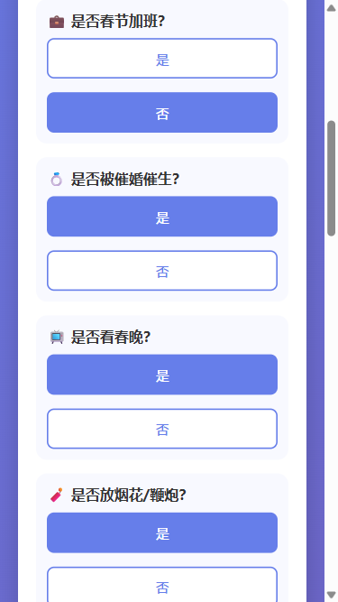
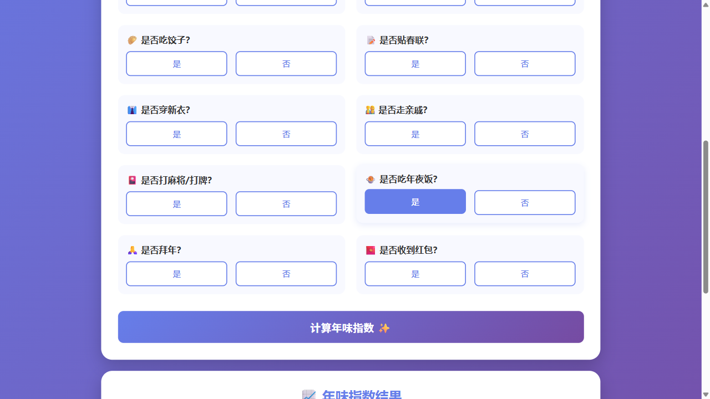

# 【新春创造营】 年味指数检测器

## 📖 项目简介

YearSense 是一个趣味十足的春节主题网站，通过14个春节相关问题，智能计算你的"年味指数"，并给出8个不同等级的年味评价。让每个人都能在春节这个特殊时刻，通过轻松有趣的方式评估自己过年的"专业程度"！

### 项目特色
- ✨ 14个精心设计的春节相关问题（回家、红包、春晚、年夜饭等）
- 🧮 智能算法计算年味指数（0-100%）
- 🏆 8个趣味年味等级称号
- 🎨 精美的渐变UI设计和响应式布局
- 📱 完美支持桌面端、平板端和移动端

## 🤖 使用 iFlow CLI 的创作过程

### 第一步：项目构思
我向 iFlow CLI 提出了需求：
> "根据文档要求创建春节'年味指数检测器'，用算法计算'你今年有多像过年'"

### 第二步：确定功能需求
通过自然语言与 iFlow CLI 沟通，明确了项目需求：

**输入选项：**
- 是否回家过年
- 是否发红包
- 是否加班
- 是否被催婚催生

**输出内容：**
- 年味指数（百分比）
- 年味等级称号

### 第三步：项目创建
iFlow CLI 自动理解需求，创建了完整的项目结构：
- HTML 页面文件
- CSS 样式文件
- JavaScript 逻辑文件

### 第四步：功能增强 - 增加趣味性
我提出需求："要增加更多的选项，增加趣味性"，并说"你自由发挥"

iFlow CLI 智能扩展了项目，新增了10个春节相关问题：
- 📺 是否看春晚
- 🧨 是否放烟花/鞭炮
- 🥟 是否吃饺子
- 📝 是否贴春联
- 👔 是否穿新衣
- 👨‍👩‍👧‍👦 是否走亲戚
- 🎴 是否打麻将/打牌
- 🍲 是否吃年夜饭
- 🙏 是否拜年
- 🧧 是否收到红包

### 第五步：算法优化
iFlow CLI 自动设计了更复杂的评分算法：
- 14个基础选项各有不同分值
- 7种特殊组合加成（如：吃年夜饭+看春晚=完美除夕夜）
- 智能计算总分并限制在0-100分范围内

### 第六步：等级系统升级
将原有的5档年味等级升级为8档：
1. 年味稀薄 ☕ (0-10分)
2. 年味淡如水 💧 (11-25分)
3. 年味若有若无 🤔 (26-40分)
4. 年味半糖半甜 🍯 (41-55分)
5. 年味刚刚好 😊 (56-70分)
6. 年味浓郁 🎆 (71-85分)
7. 年味超标 🎉 (86-95分)
8. 年味天花板 🏆 (96-100分)

### 第七步：界面优化
我提出需求："优化排版多列显示"

iFlow CLI 立即优化了布局：
- 桌面端采用2列网格布局，提升空间利用率
- 问题卡片添加背景色和悬停效果
- 完美响应式设计，支持桌面端、平板端、移动端
- 整体视觉效果更加美观、清晰

### 第八步：功能验证
iFlow CLI 自动进行了全面测试：
- 页面加载和界面显示测试
- 14个问题选项选择功能测试
- 计算算法和等级系统验证
- 响应式设计测试
- 多种组合场景测试
- 控制台错误检查

所有测试项目均通过，项目达到生产就绪状态！

## 💡 iFlow CLI 使用心得

整个创作过程，我完全通过自然语言与 iFlow CLI 交互，无需编写任何代码：

1. **需求描述清晰**：只需用自然语言描述想要的功能
2. **智能理解扩展**：iFlow CLI 能理解"自由发挥"这类开放性需求
3. **自动优化迭代**：根据反馈自动调整和优化项目
4. **质量保证**：自动进行测试和验证，确保代码质量

从最初简单的4个问题，到最终14个问题、8个等级、多列布局的完整应用，整个过程流畅自然，完全不需要了解编程细节！

## 🎯 项目亮点

1. **完全零代码**：全程通过自然语言交互完成
2. **智能扩展**：iFlow CLI 理解"自由发挥"并智能增加功能
3. **专业品质**：自动测试验证，确保代码质量
4. **快速迭代**：从想法到成品，几轮对话即可完成
5. **响应式设计**：完美适配各种设备

## 📸 项目截图

### 1. 初始界面

- 14个春节相关问题以2列网格布局展示
- 蓝紫色渐变背景，白色圆角卡片设计
- 每个问题配有语义化图标

### 2. 选择选项后

- 选项按钮选中状态为蓝色实心填充
- 未选中为白底蓝边框
- 视觉反馈清晰明确

### 3. 最高分结果

- 年味指数：100%
- 年味等级：年味天花板 🏆
- 评价：完美春节！你就是年味本味！

### 4. 移动端界面

- 响应式设计完美适配移动端
- 选项按钮垂直排列
- 字体和间距自适应调整

### 5. 中等分数结果

- 年味指数：45%
- 年味等级：年味半糖半甜 🍯
- 评价：还行还行，有点过年的意思了

## 🔗 体验链接

本地访问：打开 `index.html` 文件即可体验

## 🎊 总结

通过 iFlow CLI，我轻松创建了一个功能完整、设计精美的年味指数检测器。整个过程完全通过自然语言完成，展现了 AI 辅助编程的强大能力。这个项目不仅有趣实用，也让我体验到了 AI 编程的便利和高效！

---

**项目名称：** YearSense - 年味指数检测器
**创建时间：** 2026年2月9日
**使用工具：** iFlow CLI
**开发方式：** 100% 自然语言交互，零代码